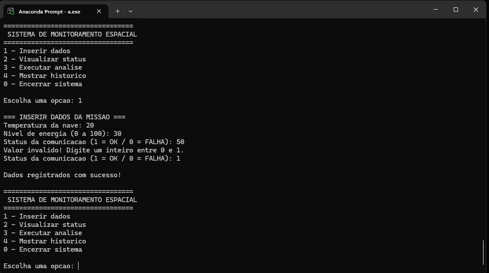

# Sistema de Monitoramento Espacial - GS2026.1

## 3. Explicação da Lógica Utilizada

- **Estrutura de Dados**: `struct Missao` armazena temperatura (float), energia (int) e comunicação (0/1).
- **Validação de Entrada**: Funções `read_int()` e `read_float()` com loops para evitar entradas inválidas.
- **Menu**: `do-while` + `switch()` (conforme exigido).
- **Análise**: Condicionais baseadas na tabela da atividade (Temperatura > 80, Energia < 20, Comunicação = 0).
- **Histórico**: Vetor de até 10 leituras (`struct Missao historico[MAX_LEITURAS]`).
- **Modularidade**: Funções separadas para melhor organização e manutenção.

## 4. Demonstração Prática do Sistema

### Exemplo de uso:
=== INSERIR DADOS DA MISSAO ===
Temperatura da nave: 92.4
Nivel de energia: 12
Status da comunicacao: 0
=== ANALISE DA MISSAO ===
ALERTA: Superaquecimento detectado!
ALERTA: Economia de energia ativada!
ALERTA: Falha de comunicacao!
STATUS GERAL: ATENCAO NECESSARIA

Demonstracao do Uso do projeto na linha de comando